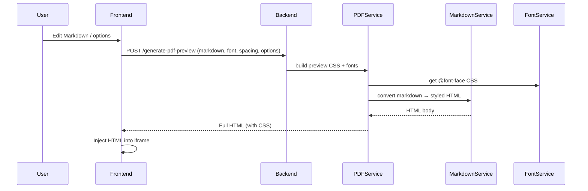
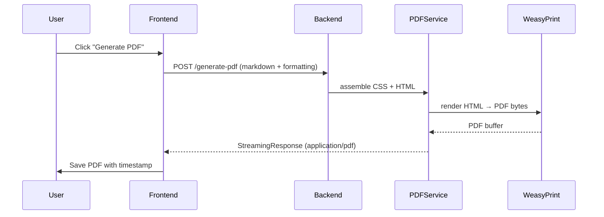

# Architecture Overview

This document summarizes the end-to-end architecture of the Markdown to PDF converter. It highlights how the Next.js frontend coordinates with the FastAPI backend, and how the backend assembles typography assets, converts Markdown to HTML, and renders PDFs.

## System Context

```mermaid
flowchart LR
  subgraph Browser
    UI[Markdown Editor + Controls]
    Preview[PDF Preview iframe]
  end

  subgraph Frontend[Next.js / React]
    APIClient[API client (fetch + React Query)]
    State[Formatting Context (Typography/Layout/Filename)]
  end

  subgraph Backend[FastAPI]
    Router[API Router]\n/generate-pdf\n/generate-pdf-preview\n/fonts
    PDFSvc[PDF Service]
    MDService[Markdown Service]
    FontSvc[Font Service]
  end

  Assets[Static CSS + Fonts]

  UI -->|edits Markdown + options| State
  State --> APIClient
  APIClient -->|POST markdown + options| Router
  Router --> PDFSvc
  PDFSvc --> MDService
  PDFSvc --> FontSvc
  FontSvc --> Assets
  MDService --> Assets
  PDFSvc -->|HTML/PDF bytes| APIClient
  APIClient --> Preview
  APIClient -->|download| UI
```

*The frontend sends Markdown plus formatting options to the backend. The backend renders HTML using Markdown + CSS, loads fonts, and returns either HTML (for preview) or a PDF stream.*

## Backend Architecture

```mermaid
flowchart TB
  APIRouter[/app/api/__init__.py/] --> PDFRoute[/app/api/pdf.py/]
  APIRouter --> FontsRoute[/app/api/fonts.py/]

  PDFRoute -->|validates with| PDFModel[PDFGenerationRequest (Pydantic)]
  PDFRoute --> PDFService[PDFService]
  FontsRoute --> FontService

  PDFService -->|build CSS + fonts| FontService
  PDFService -->|Markdown → HTML| MarkdownService
  PDFService -->|HTML → PDF| WeasyPrint

  MarkdownService -->|sanitize + render| MarkdownLib[(python-markdown extensions)]
  MarkdownService -->|generate index + ids| Indexing
```

Key responsibilities:

- **API layer** (`app/api`): exposes `/generate-pdf`, `/generate-pdf-preview`, and `/fonts` routes and maps payloads to `PDFGenerationRequest` with validation for font availability and Markdown presence.
- **Services** (`app/services`):
  - `PDFService` orchestrates font registration, CSS assembly (page settings, font stacks, theme styles), Markdown-to-HTML conversion, and PDF rendering via WeasyPrint. Preview mode injects extra CSS for visible page breaks.
  - `MarkdownService` preprocesses nested lists, sanitizes glyphs, renders Markdown with code highlighting, injects heading IDs, builds optional table of contents pages, and ensures PDF-friendly spacing.
  - `FontService` registers bundled font families with ReportLab, exposes available font names to the frontend, and emits `@font-face` rules for preview/PDF contexts.
- **Static assets** (`app/static/css`, `app/static/fonts`): provide theme CSS and font files shared by preview and PDF generation.

## Frontend Architecture

```mermaid
flowchart TB
  App[app/page.tsx]\nProviders --> Typography[TypographyPanel]
  App --> Layout[LayoutPanel]
  App --> Editor[MarkdownEditor]
  App --> Preview[PDFPreview]
  App --> Actions[PDFActions\n(Filename + GenerateButton)]

  subgraph Providers
    DarkMode[DarkModeProvider]
    Formatting[FormattingProvider\n(Typography/Layout/Filename contexts)]
    Query[React Query Client]
  end

  Actions --> GenerateBtn[GenerateButton]
  Preview --> ThrottleHook[useThrottledPreview]
  ThrottleHook --> APIClient[api.ts]
  GenerateBtn --> APIClient
  Typography --> Formatting
  Layout --> Formatting
  Editor --> Preview
```

Front-end flow:

1. `FormattingProvider` maintains typography (font, size), layout (spacing, index, page breaks, auto-width tables), and filename state that child panels manipulate.
2. `app/lib/api.ts` exposes fetch helpers for `/fonts`, `/generate-pdf-preview`, and `/generate-pdf` requests. React Query handles mutations for PDF downloads.
3. `PDFPreview` uses `useThrottledPreview` to debounce preview requests and writes returned HTML into an iframe for immediate visual feedback.
4. `GenerateButton` posts the same payload to retrieve PDF bytes and saves the file with a timestamp.

## Request Lifecycles

**Preview**



**PDF Generation**



## Deployment & Runtime Notes

- The backend loads environment variables via `python-dotenv` before initializing the FastAPI app.
- CORS is configured for `http://localhost:3000` (frontend) and `http://localhost:8000` (local testing).
- Font registration happens lazily on first request and falls back to system fonts if assets are missing.
- Preview uses public font paths (`/fonts/...`), while PDF generation references the frontend `public/fonts` directory relative to the backend.
