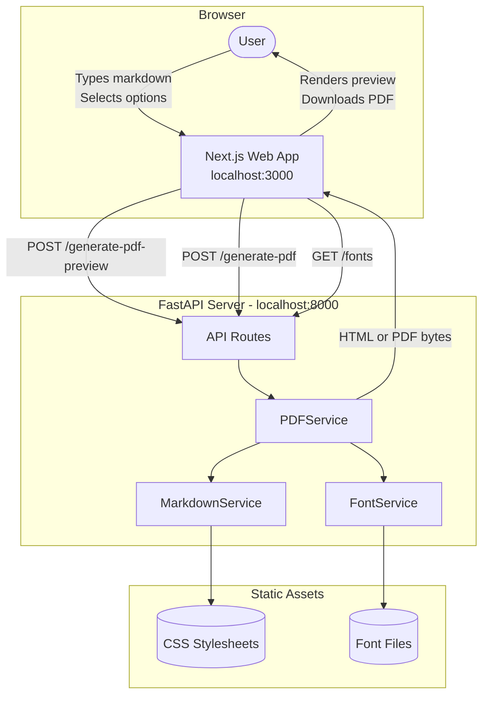
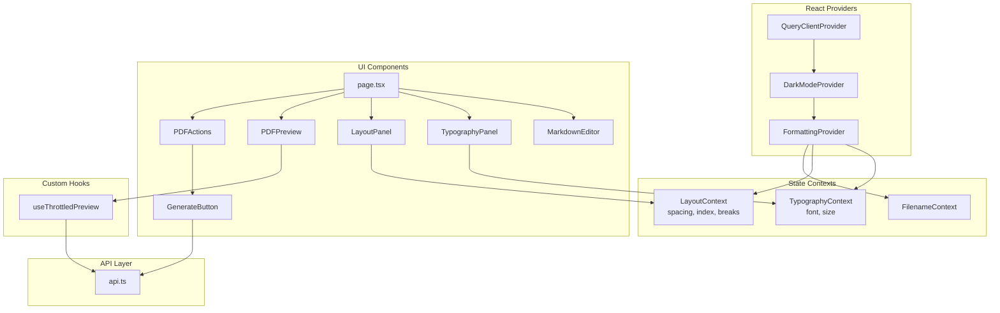
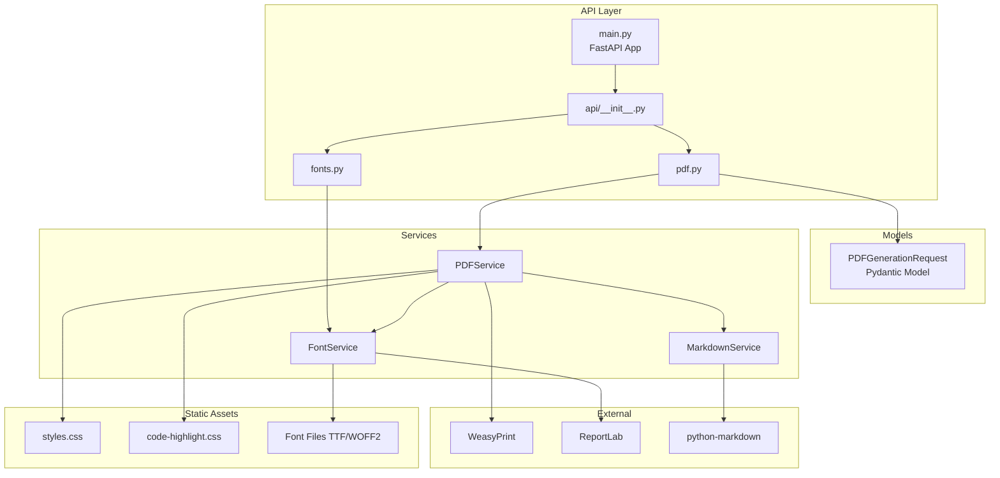
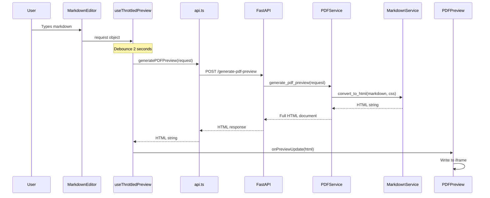
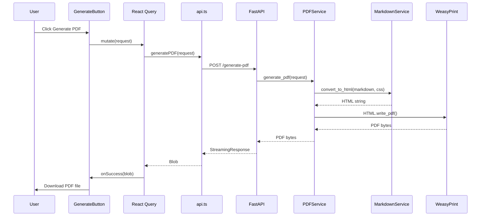
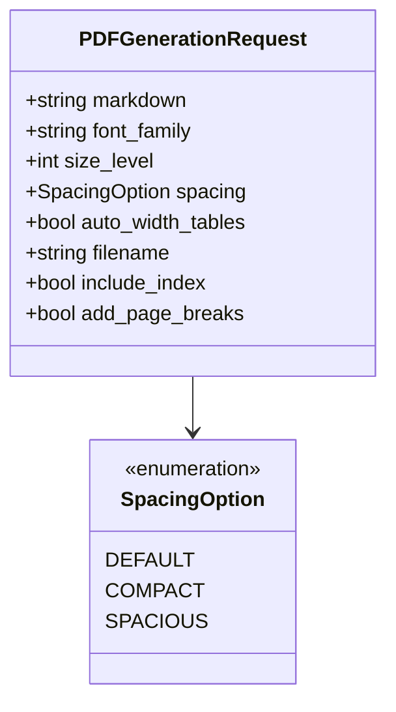

# Architecture Overview

This document describes the architecture of the Markdown to PDF converter application—a full-stack system with a React/Next.js frontend and a Python/FastAPI backend.

## High-Level System Architecture

## Frontend Architecture

The frontend is a Next.js application using React with TypeScript. It uses React Query for API state management and React Context for UI state.

### Key Frontend Components

| Component             | Purpose                                             |
| --------------------- | --------------------------------------------------- |
| `page.tsx`            | Root page, sets up providers and layout             |
| `FormattingContext`   | Manages typography, layout, and filename state      |
| `MarkdownEditor`      | Textarea for markdown input                         |
| `TypographyPanel`     | Font family and size controls                       |
| `LayoutPanel`         | Spacing, table width, index, and page break options |
| `PDFPreview`          | Displays live HTML preview in an iframe             |
| `GenerateButton`      | Triggers PDF generation and download                |
| `useThrottledPreview` | Debounces preview API calls (2s delay)              |

## Backend Architecture

The backend is a FastAPI application that converts Markdown to styled HTML and renders PDFs using WeasyPrint.

### Backend Services

| Service           | Responsibility                                                                                                                      |
| ----------------- | ----------------------------------------------------------------------------------------------------------------------------------- |
| `PDFService`      | Orchestrates CSS assembly, calls MarkdownService for HTML, renders PDF via WeasyPrint                                               |
| `MarkdownService` | Converts Markdown to HTML with extensions (tables, fenced code, syntax highlighting), adds heading IDs, generates table of contents |
| `FontService`     | Registers fonts with ReportLab, provides @font-face CSS rules, lists available fonts                                                |

## API Endpoints

| Method | Endpoint                | Description                                 |
| ------ | ----------------------- | ------------------------------------------- |
| `POST` | `/generate-pdf`         | Returns PDF bytes as streaming response     |
| `POST` | `/generate-pdf-preview` | Returns styled HTML for iframe preview      |
| `GET`  | `/fonts`                | Returns list of available font family names |
| `GET`  | `/health`               | Health check endpoint                       |

## Request Flow: Live Preview

## Request Flow: PDF Generation

## Data Model

## Technology Stack

| Layer         | Technologies                                               |
| ------------- | ---------------------------------------------------------- |
| Frontend      | Next.js 15, React 19, TypeScript, TailwindCSS, React Query |
| Backend       | Python 3.11+, FastAPI, Uvicorn, Pydantic                   |
| PDF Rendering | WeasyPrint                                                 |
| Markdown      | python-markdown with extensions                            |
| Fonts         | ReportLab (registration), custom TTF/WOFF2 files           |
