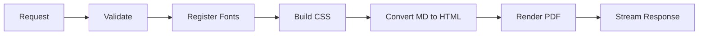
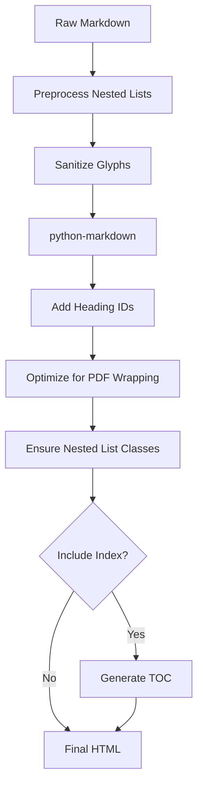
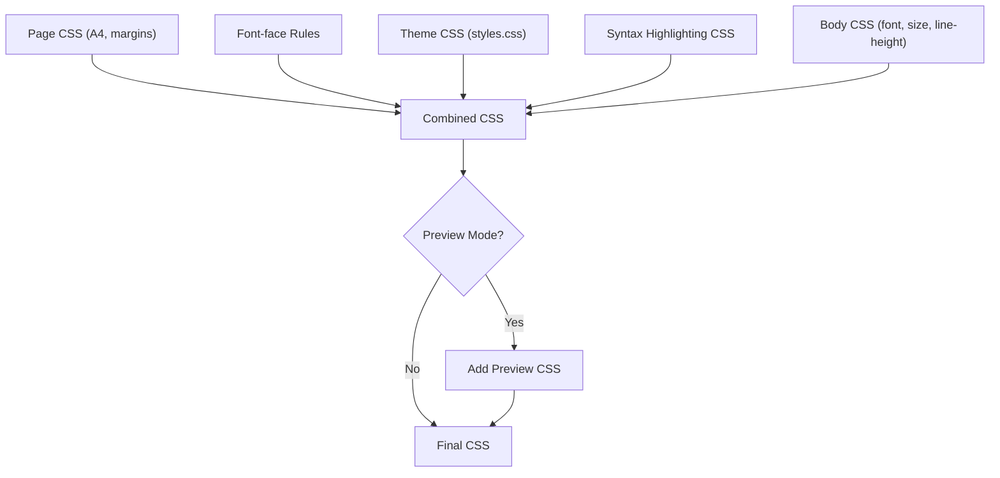
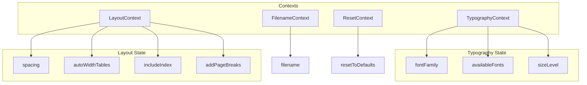

# System Specification

This document defines the functional requirements, data contracts, and behaviors of the Markdown to PDF application.

## Functional Requirements

### Core Features

1. **Markdown Input** — Accept CommonMark + GitHub-flavored Markdown via a text editor
2. **Live Preview** — Render a styled HTML preview that matches final PDF output
3. **PDF Generation** — Generate downloadable PDF with embedded fonts and syntax highlighting
4. **Typography Controls** — Select font family and size level
5. **Layout Controls** — Configure spacing, table width behavior, table of contents, and page breaks
6. **Font Listing** — Expose available fonts to the frontend for selection

## API Specification

### POST `/generate-pdf`

Generates a PDF document from markdown content.

**Request Body:**

```json
{
  "markdown": "string (required)",
  "font_family": "string (default: Inter)",
  "size_level": "integer 1-5 (default: 3)",
  "spacing": "default | compact | spacious",
  "auto_width_tables": "boolean (default: true)",
  "filename": "string (optional)",
  "include_index": "boolean (default: false)",
  "add_page_breaks": "boolean (default: false)"
}
```

**Response:** `application/pdf` stream with `Content-Disposition` header

**Processing Flow:**



### POST `/generate-pdf-preview`

Generates an HTML preview of the PDF content.

**Request Body:** Same as `/generate-pdf`

**Response:** `text/html` containing full HTML document with embedded CSS

**Differences from PDF generation:**

- Uses web-accessible font paths (`/fonts/...`)
- Includes preview-specific CSS for page break visualization
- Returns HTML instead of PDF bytes

### GET `/fonts`

Returns available font families.

**Response:** `application/json` array of font family names

```json
["Inter", "Roboto", "OpenSans", "Lato", ...]
```

### GET `/health`

Health check endpoint.

**Response:** `{"status": "ok"}`

## Data Contracts

### PDFGenerationRequest

| Field               | Type    | Default     | Validation                         |
| ------------------- | ------- | ----------- | ---------------------------------- |
| `markdown`          | string  | required    | Must not be empty                  |
| `font_family`       | string  | `"Inter"`   | Must be in available fonts list    |
| `size_level`        | integer | `3`         | Range: 1-5                         |
| `spacing`           | enum    | `"default"` | One of: default, compact, spacious |
| `auto_width_tables` | boolean | `true`      | —                                  |
| `filename`          | string  | `null`      | Optional download filename         |
| `include_index`     | boolean | `false`     | Generate table of contents         |
| `add_page_breaks`   | boolean | `false`     | Page breaks before H1 headings     |

### Size Level Mapping

| Level | Font Size |
| ----- | --------- |
| 1     | 9px       |
| 2     | 12px      |
| 3     | 14px      |
| 4     | 16px      |
| 5     | 20px      |

### Spacing Mapping

| Option   | Line Height |
| -------- | ----------- |
| compact  | 1.2         |
| default  | 1.4         |
| spacious | 1.6         |

## Processing Pipeline

### Markdown to HTML Conversion



### Markdown Extensions Used

| Extension             | Purpose                          |
| --------------------- | -------------------------------- |
| `TableExtension`      | GitHub-style tables              |
| `FencedCodeExtension` | Fenced code blocks               |
| `CodeHiliteExtension` | Syntax highlighting via Pygments |
| `ExtraExtension`      | Additional markdown features     |
| `LineBreakExtension`  | Custom newline handling          |

### Glyph Sanitization

Problematic Unicode characters are replaced with safe ASCII equivalents:

| Character                               | Replacement           |
| --------------------------------------- | --------------------- |
| `\u2013` (en dash)                      | `-`                   |
| `\u2014` (em dash)                      | `-`                   |
| `\u00a0` (nbsp)                         | ` `                   |
| `\u2018` `\u2019` (curly single quotes) | `'`                   |
| `\u201c` `\u201d` (curly double quotes) | `"`                   |
| `\~` `\&` `\$` `\#` etc.                | Unescaped equivalents |

## CSS Assembly

The PDF/preview CSS is assembled from multiple sources:



## Font System

### Available Font Families

| Category        | Fonts                                           |
| --------------- | ----------------------------------------------- |
| SF-style        | Inter, AlbertSans, HankenGrotesk                |
| Futura-style    | Jost, Spartan, Formera                          |
| Helvetica-style | Archivo, Manrope, Barlow                        |
| Other Sans      | OpenSans, Lato, NunitoSans, IBMPlexSans, Roboto |
| Monospace       | MesloLGS, SourceCodePro                         |
| System          | Helvetica, Times-Roman, Courier                 |

### Font Loading

- **PDF generation:** Fonts loaded from `../markdown2pdf-webapp/public/fonts/`
- **Preview mode:** Fonts served via `/fonts/...` web path
- **Registration:** Fonts registered with ReportLab on first use (lazy)

## Error Handling

| Scenario                   | Behavior                        |
| -------------------------- | ------------------------------- |
| Empty markdown             | Pydantic validation error (400) |
| Invalid font               | Pydantic validation error (400) |
| PDF generation failure     | HTTP 500 with generic message   |
| Preview generation failure | HTTP 500 with generic message   |

## Frontend State Management



## Performance Considerations

| Feature               | Implementation                                   |
| --------------------- | ------------------------------------------------ |
| Preview debouncing    | 2-second delay via `useThrottledPreview`         |
| Component memoization | `React.memo` with custom equality checks         |
| Font caching          | Lazy registration, cached after first use        |
| Context splitting     | Separate contexts prevent unnecessary re-renders |

## CORS Configuration

Allowed origins:

- `http://localhost:3000` (Next.js dev server)
- `http://localhost:8000` (Local API testing)
